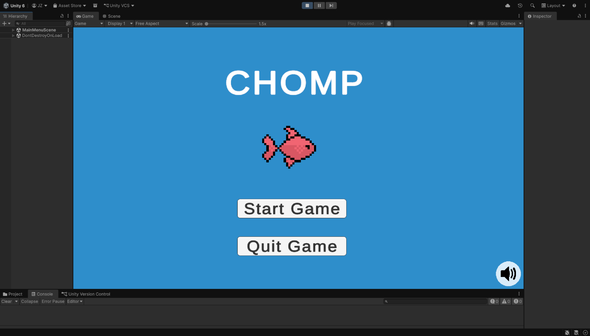
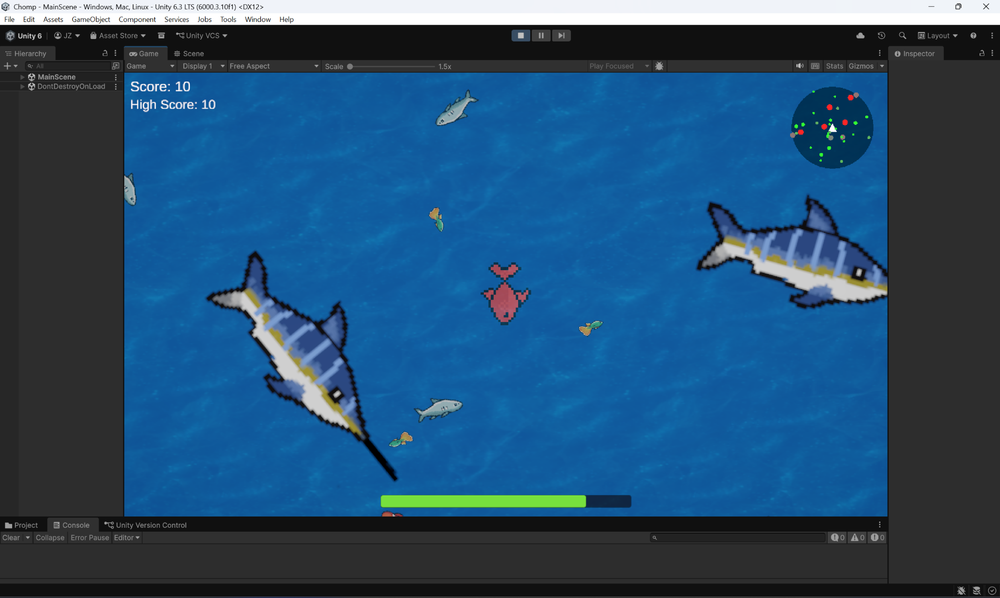

# Chomp

Chomp is a Unity game where you play as a goldfish trying to survive by eating smaller fish, growing larger, and avoiding bigger fish.

Play the web build here:  
[Chomp](https://play.unity.com/en/games/a730ef1c-91df-4f8a-9842-6a603bd6d0d4/chompwebbuild)

## Gameplay

The player controls a goldfish that must eat smaller fish to grow and survive. A hunger bar constantly decreases over time, and eating fish restores hunger. If the player does not eat, the goldfish begins to shrink.

Fish size affects the gameplay:
- Smaller fish can be eaten by the player
- Larger fish can eat the player
- Same-size fish are neutral
- Larger edible fish provide a bigger increase to hunger and size
- Smaller edible fish have less effect as the player grows larger

As the player grows, movement speed decreases. When the player is smaller, movement speed is faster.

## Features

- Player growth and shrinking system
- Hunger bar that decreases over time
- Multiple fish types and sizes
- Larger fish can eat the player
- Edible fish increase size and hunger
- Score and high score tracking
- Sound effects when eating fish
- Sprint option that increases speed but drains hunger faster
- Radar system showing nearby fish
- Color-coded radar icons:
  - Green: edible fish
  - Gray: neutral fish
  - Red: dangerous fish that can eat the player

## Controls

| Action | Control |
|---|---|
| Move | WASD or Arrow Keys |
| Sprint | Space Bar |

## Screenshots

### Main Menu

### Gameplay

## Technologies

- Unity
- C#
- Unity WebGL

## Notes

This project was built as a Unity game project focused on gameplay mechanics, player scaling, enemy behavior, hunger management, scoring, sound effects, and interactive game systems.
